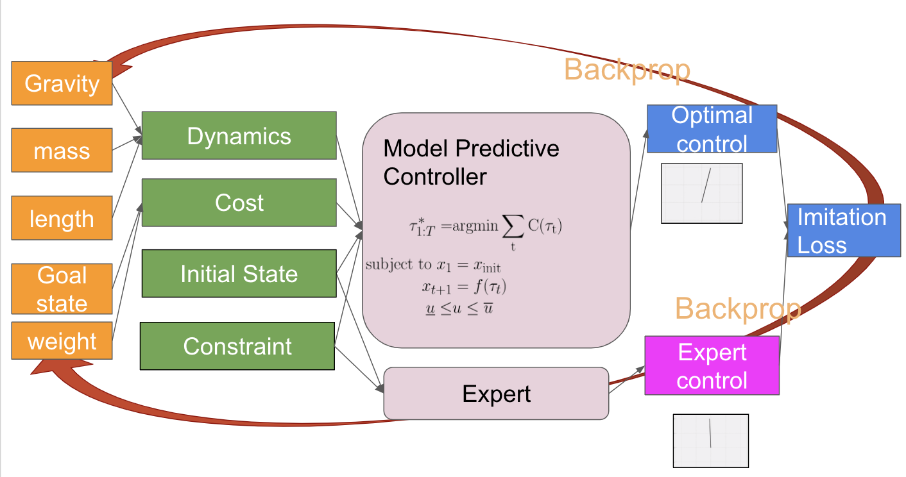
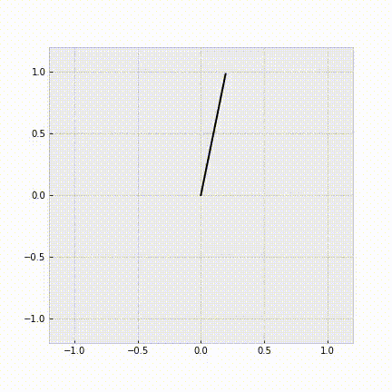

# Differentiable MPC in Chainer

Attempt to port [mpc.pytorch](https://github.com/locuslab/mpc.pytorch) to [Chainer](https://chainer.org).

**Disclaimer: PFN provides no warranty or support for this software. Use it at your own risk.**

This software is developed as part of [PFN summer internship 2019](https://preferred.jp/en/news/internship2019/) and the main developer is Shun Arahata.

## Overview of Differentiable MPC


## Install
```
$ pipenv install
```

## Dependencies
This code has been tested using libraries below:
* numpy = "1.17.2"
* chainer = "6.3.0"
* jupyter = "1.0.0"
* matplotlib = "3.1.1"
* jupytext = "1.2.4"
* scipy = "1.3.1"
* pathlib = "1.0.1"
* torch = "1.2.0"

See also `Pipfile`.

## Usage
```
$ pipenv run python env_dx/make_dataset.py
$ pipenv run python env_dx/il_exp.py
```

## Example Result


## References

* [1] B. Amos, I. Jimenez, J. Sacks, B. Boots, and Z. Kolter. “Differentiable MPC for End-to-end Planning and Control”
In NIPS'18 Proceedings of Advances in Neural Information Processing Systems. 
Available: https://arxiv.org/abs/1810.13400 . Experiment code: https://github.com/locuslab/differentiable-mpc

* [2] Yuval Tassa, Nicolas Mansard and Emo Todorov. “Control-Limited Differential Dynamic Programming” ICRA'14 IEEE International Conference on Robotics and Automation. Available: https://homes.cs.washington.edu/~todorov/papers/TassaICRA14.pdf . Code: https://jp.mathworks.com/matlabcentral/fileexchange/52069-ilqg-ddp-trajectory-optimization

* [3] Brandon Amos, and J. Zico Kolter, “OptNet: Differentiable Optimization as a Layer in Neural Networks” In ICML'17 Proceedings of the 34th International Conference on Machine Learning. Available: https://arxiv.org/abs/1703.00443 . Code: https://github.com/locuslab/qpth/ . Chainer-port: https://github.com/msakai/chainer-optnet

* [4] Yuval Tassa, Tom Erez and Emanuel Todorov. “Synthesis and Stabilization of Complex Behaviors through
Online Trajectory Optimization” IROS'12 IEEE/RSJ International Conference on Intelligent Robots and Systems. Available: https://homes.cs.washington.edu/~todorov/papers/TassaIROS12.pdf .

## Useful Links
* [RL — LQR & iLQR Linear Quadratic Regulator](https://medium.com/@jonathan_hui/rl-lqr-ilqr-linear-quadratic-regulator-a5de5104c750)

* [EE363: Lecture Slides (Lecture by Stephen P. Boyd)](https://stanford.edu/class/ee363/lectures.html)

* [Optimal Control and
Planning, CS 294-112: Deep Reinforcement Learning
Sergey Levine](http://rail.eecs.berkeley.edu/deeprlcourse-fa17/f17docs/lecture_8_model_based_planning.pdf)

* [Synthesis and Stabilization of Complex Behaviors through Online Trajectory Optimization](https://speakerdeck.com/yuishihara/synthesis-and-stabilization-of-complex-behaviors-through-online-trajectory-optimization) [in Japanese]

* [Differential Dynamic Programming(DDP)/iterative LQR(iLQR)/Sequential LQR(SLQ)](http://blog.syundo.org/post/20180917-ddp-ilqr-slq/) [in Japanese]

## LICENSE

MIT License (see the [LICENSE](LICENSE) file for details).

Note: Part of the code is derived from [mpc.pytorch](https://github.com/locuslab/mpc.pytorch) and [differentiable-mpc](https://github.com/locuslab/differentiable-mpc/) which are also licensed under MIT License (see the [LICENSE_THIRD_PARTY](LICENSE_THIRD_PARTY) file for details).
Also this package still uses [PyTorch](https://pytorch.org/) for fast batch LU factorization (`torch.lu`) and solving (`torch.lu_solve`).

